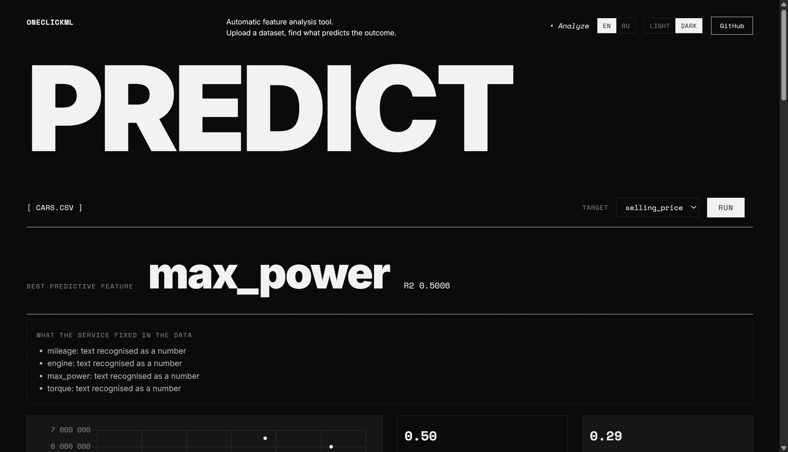
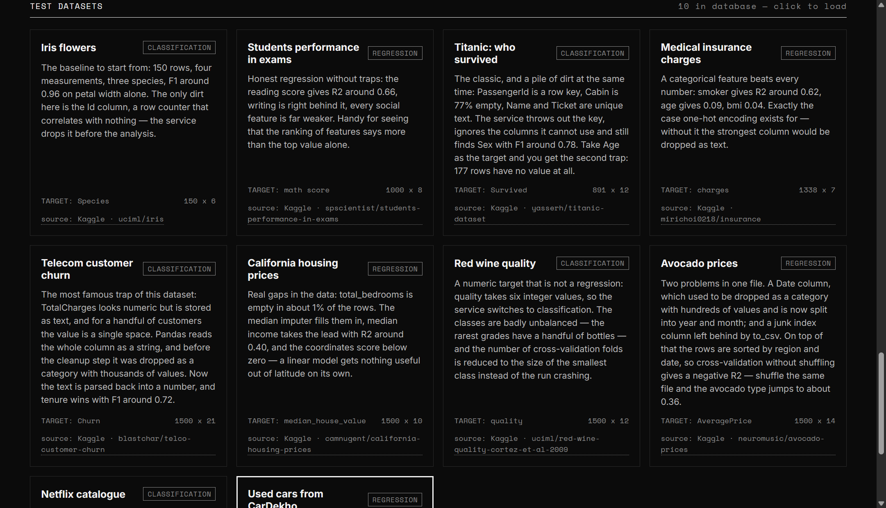

# OneClickML

Загружаешь CSV, выбираешь целевую колонку, получаешь самый предсказательный
признак, его score и график связи с таргетом. Тип задачи (регрессия или
классификация) определяется автоматически.

Интерфейс на двух языках (английский по умолчанию, переключатель EN/RU) и в двух
темах — светлой и тёмной. Выбор запоминается в браузере.



## Быстрый старт

```bash
cp .env.example .env
docker compose up -d --build
```

Приложение: http://localhost:8080
Swagger: http://localhost:8000/docs

Больше ничего ставить не нужно — ни Python, ни Postgres, ни nginx. Всё три
сервиса поднимаются из `docker-compose.yml`.

## Тестовые датасеты

Все десять датасетов каталога взяты с Kaggle. Это не синтетика: файлы лежат в
`database/seed/` ровно в том виде, в каком их отдаёт Kaggle, со всеми пропусками,
мусорными столбцами и странными форматами. Ссылка на страницу-источник есть на
каждой карточке и в поле `source` у `/api/datasets`.

| Датасет | Kaggle | Таргет | Чем интересен |
|---|---|---|---|
| Ирисы Фишера | `uciml/iris` | `Species` | эталон: чистые измерения, F1 около 0.96 |
| Успеваемость студентов | `spscientist/students-performance-in-exams` | `math score` | честная регрессия без ловушек |
| Титаник | `yasserh/titanic-dataset` | `Survived` | пропуски, ключ строки, уникальный текст |
| Медицинская страховка | `mirichoi0218/insurance` | `charges` | категория обыгрывает все числа |
| Отток телекома | `blastchar/telco-customer-churn` | `Churn` | число, записанное текстом, и пробел вместо пропуска |
| Жильё в Калифорнии | `camnugent/california-housing-prices` | `median_house_value` | настоящие пропуски в признаке |
| Красное вино | `uciml/red-wine-quality-cortez-et-al-2009` | `quality` | числовой таргет, который на деле классификация |
| Цены на авокадо | `neuromusic/avocado-prices` | `AveragePrice` | даты и мусорный столбец-индекс |
| Каталог Netflix | `shivamb/netflix-shows` | `type` | даты словами, смесь единиц, категории-одиночки |
| Машины CarDekho | `nehalbirla/vehicle-dataset-from-cardekho` | `selling_price` | числа с единицами: `23.4 kmpl`, `1248 CC` |

Файлы скачиваются скриптом — ключ Kaggle не нужен, датасеты публичные:

```bash
python database/seed/fetch_kaggle.py
```

Единственная правка к оригиналам — размер: файлы длиннее 1500 строк прорежены
случайной выборкой с фиксированным `random_state`, чтобы репозиторий и ответы API
не распухали. Колонки, форматы и пропуски не трогали.



## Что сервис чинит в данных сам

Сырые данные с Kaggle ломали анализ: даты и числа с единицами измерения
выбрасывались как «категория с тысячами значений», а пропуск в таргете или
класс-одиночка роняли обучение с ошибкой sklearn. Этим занимается `cleaning.py`,
до того как данные попадут в пайплайн:

- **даты** — `2015-12-27`, `25/09/2021`, `September 25, 2021` разбираются на
  год, месяц и день недели, дальше это обычные числовые признаки
- **числа в тексте** — `23.4 kmpl`, `1248 CC`, `74 bhp`, `1,234.56`, пробел
  вместо пропуска. Единица отделяется только если она одинакова по всей колонке,
  поэтому номер билета `A/5 21171` числом не станет
- **служебные столбцы** — безымянный индекс от `to_csv` и ключи записей вроде
  `PassengerId` или `customerID` выбрасываются
- **пропуски в таргете** — такие строки убираются, а не роняют анализ
- **редкие классы** — категории с одним объектом отбрасываются, число фолдов
  кросс-валидации подстраивается под самый маленький класс

Всё, что сделано с данными, возвращается в поле `cleanup` ответа `/api/analyze` и
показывается на странице под результатом — сервис не молчит о том, что поменял.

## История запросов

Каждый анализ записывается в таблицу `runs`: когда, какой файл, какой таргет,
какой признак победил и с каким score. История видна на странице и доступна
через `/api/history`, кнопка CLEAR её очищает.

В отличие от каталога датасетов, это уже настоящие пользовательские данные — они
не восстанавливаются из файлов. Поэтому `docker compose down -v` их теряет
навсегда, а обычный `docker compose down` — нет.

## Тесты и линтер

```bash
pip install -r backend/requirements-dev.txt
cd backend && ruff check . && pytest --cov=.
```

37 тестов на ML-ядро, подготовку данных и API, покрытие 92%. Те же команды гоняет CI на каждый
pull request.

## Структура

```
backend/            FastAPI + ML-ядро
  app.py            эндпоинты /api/*
  core.py           ML-ядро: analyze(df, target) -> dict
  cleaning.py       подготовка сырых данных: даты, единицы измерения, мусорные столбцы
  db.py             Postgres через SQLAlchemy, каталог датасетов и история
  tests/            pytest: ядро и API
  Dockerfile
frontend/           статика и nginx
  static/           index.html, app.js, i18n.js, style.css
  nginx.conf        раздача статики плюс проксирование /api на бэкенд
  Dockerfile
database/seed/      CSV датасетов с Kaggle, catalog.json с описаниями и fetch_kaggle.py
docker-compose.yml  три сервиса: db + backend + frontend
.github/workflows/  ci.yml (линтер, тесты, сборка, smoke) и cd.yml (публикация)
ml.py               песочница, с которой начинался проект
```

ML-логика отделена от веб-слоя: `core.py` ничего не знает про HTTP, его можно
переиспользовать и тестировать отдельно.

## Как это устроено в Docker

```
          :8080                     :8000
браузер ──────▶ frontend ──────────▶ backend ────────▶ db
                (nginx)    /api/*    (FastAPI)  :5432  (Postgres)
                                                         │
                                                    том pgdata
```

- `frontend` раздаёт статику и проксирует `/api/*` на бэкенд, поэтому браузер
  ходит на один origin и CORS не нужен
- `backend` считает ML и читает каталог датасетов из базы
- `db` наружу не проброшен: Postgres доступен только внутри сети compose.
  Контейнеры находят друг друга по имени сервиса (`db`, `backend`), это делает
  встроенный DNS Docker
- данные базы лежат в именованном томе `pgdata` и переживают пересоздание
  контейнеров. `database/seed/` примонтирована в бэкенд как bind mount только на
  чтение, поэтому правки в CSV и описаниях подхватываются без пересборки образа
- в базе две таблицы: `datasets` заливается из файлов при каждом старте, `runs`
  копит историю запусков и существует только в томе

Настройки приходят через переменные окружения. Пароль лежит в `.env`, который не
коммитится; в репозитории только `.env.example`. В образ секреты не зашиваются.

### Команды

```bash
docker compose up -d --build     # собрать и поднять
docker compose ps                # статус сервисов
docker compose logs -f backend   # логи бэкенда
docker compose restart backend   # перечитать seed после правки catalog.json
docker compose down              # остановить, данные в томе сохранятся
docker compose down -v           # остановить и удалить данные базы
```

Заглянуть в базу:

```bash
docker compose exec db psql -U oneclick -d oneclickml -c "SELECT slug, target, task FROM datasets;"
```

## Запуск без Docker

```bash
pip install -r backend/requirements.txt
cd backend && uvicorn app:app --reload
```

Открой http://127.0.0.1:8000. Без переменной `DATABASE_URL` каталог датасетов
кладётся в локальный SQLite-файл, Postgres не нужен.

## Эндпоинты

| Метод | Путь | Что делает |
|---|---|---|
| POST | `/api/analyze` | multipart: `file` = CSV, `target` = имя колонки. Возвращает `task`, `best_feature`, `best_score`, `feature_scores`, `chart`, `cleanup` |
| POST | `/api/predict` | те же поля плюс `values` = JSON со значениями признаков |
| GET | `/api/history` | последние запуски анализа, параметр `limit` (по умолчанию 20) |
| DELETE | `/api/history` | очистить историю |
| GET | `/api/datasets` | каталог тестовых датасетов из базы |
| GET | `/api/datasets/{slug}` | один датасет вместе с CSV |
| GET | `/api/health` | статус сервиса, базы, число датасетов и запусков |
