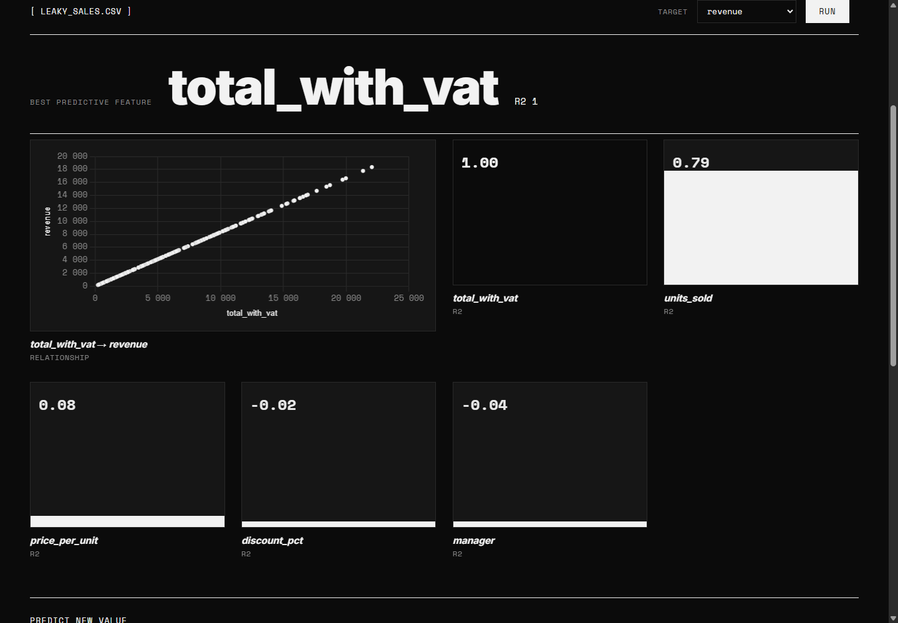

# OneClickML

Загружаешь CSV, выбираешь целевую колонку, получаешь самый предсказательный
признак, его score и график связи с таргетом. Тип задачи (регрессия или
классификация) определяется автоматически.

Интерфейс на двух языках (английский по умолчанию, переключатель EN/RU) и в двух
темах — светлой и тёмной. Выбор запоминается в браузере.


## Быстрый старт

```bash
cp .env.example .env
docker compose up -d --build
```

Приложение: http://localhost:8080
Swagger: http://localhost:8000/docs

Больше ничего ставить не нужно — ни Python, ни Postgres, ни nginx. Всё три
сервиса поднимаются из `docker-compose.yml`.

## Тестовые датасеты

При старте бэкенд заливает в Postgres семь датасетов из `database/seed/`. Каждый
показывает свою ситуацию: чистую линейную связь, перевес категориального признака
над числовыми, несбалансированные классы, утечку таргета, отсутствие связи вообще.
Клик по карточке подставляет датасет в анализ.


Например, `Sales with target leakage` — ловушка: колонка `total_with_vat` это сам
таргет, умноженный на 1.2, и R2 по ней ровно 1.00. Идеальный score почти всегда
означает не отличную модель, а просочившийся в признаки ответ.



## История запросов

Каждый анализ записывается в таблицу `runs`: когда, какой файл, какой таргет,
какой признак победил и с каким score. История видна на странице и доступна
через `/api/history`, кнопка CLEAR её очищает.

В отличие от каталога датасетов, это уже настоящие пользовательские данные — они
не восстанавливаются из файлов. Поэтому `docker compose down -v` их теряет
навсегда, а обычный `docker compose down` — нет.

## Структура

```
backend/            FastAPI + ML-ядро
  app.py            эндпоинты /api/*
  core.py           ML-ядро: analyze(df, target) -> dict
  db.py             Postgres через SQLAlchemy, каталог датасетов
  Dockerfile
frontend/           статика и nginx
  static/           index.html, app.js, i18n.js, style.css
  nginx.conf        раздача статики плюс проксирование /api на бэкенд
  Dockerfile
database/seed/      CSV тестовых датасетов и catalog.json с описаниями
docker-compose.yml  три сервиса: db + backend + frontend
ml.py               песочница, с которой начинался проект
```

ML-логика отделена от веб-слоя: `core.py` ничего не знает про HTTP, его можно
переиспользовать и тестировать отдельно.

## Как это устроено в Docker

```
          :8080                     :8000
браузер ──────▶ frontend ──────────▶ backend ────────▶ db
                (nginx)    /api/*    (FastAPI)  :5432  (Postgres)
                                                         │
                                                    том pgdata
```

- `frontend` раздаёт статику и проксирует `/api/*` на бэкенд, поэтому браузер
  ходит на один origin и CORS не нужен
- `backend` считает ML и читает каталог датасетов из базы
- `db` наружу не проброшен: Postgres доступен только внутри сети compose.
  Контейнеры находят друг друга по имени сервиса (`db`, `backend`), это делает
  встроенный DNS Docker
- данные базы лежат в именованном томе `pgdata` и переживают пересоздание
  контейнеров. `database/seed/` примонтирована в бэкенд как bind mount только на
  чтение, поэтому правки в CSV и описаниях подхватываются без пересборки образа
- в базе две таблицы: `datasets` заливается из файлов при каждом старте, `runs`
  копит историю запусков и существует только в томе

Настройки приходят через переменные окружения. Пароль лежит в `.env`, который не
коммитится; в репозитории только `.env.example`. В образ секреты не зашиваются.

### Команды

```bash
docker compose up -d --build     # собрать и поднять
docker compose ps                # статус сервисов
docker compose logs -f backend   # логи бэкенда
docker compose restart backend   # перечитать seed после правки catalog.json
docker compose down              # остановить, данные в томе сохранятся
docker compose down -v           # остановить и удалить данные базы
```

Заглянуть в базу:

```bash
docker compose exec db psql -U oneclick -d oneclickml -c "SELECT slug, target, task FROM datasets;"
```

## Запуск без Docker

```bash
pip install -r backend/requirements.txt
cd backend && uvicorn app:app --reload
```

Открой http://127.0.0.1:8000. Без переменной `DATABASE_URL` каталог датасетов
кладётся в локальный SQLite-файл, Postgres не нужен.

## Эндпоинты

| Метод | Путь | Что делает |
|---|---|---|
| POST | `/api/analyze` | multipart: `file` = CSV, `target` = имя колонки. Возвращает `task`, `best_feature`, `best_score`, `feature_scores`, `chart` |
| POST | `/api/predict` | те же поля плюс `values` = JSON со значениями признаков |
| GET | `/api/history` | последние запуски анализа, параметр `limit` (по умолчанию 20) |
| DELETE | `/api/history` | очистить историю |
| GET | `/api/datasets` | каталог тестовых датасетов из базы |
| GET | `/api/datasets/{slug}` | один датасет вместе с CSV |
| GET | `/api/health` | статус сервиса, базы, число датасетов и запусков |
